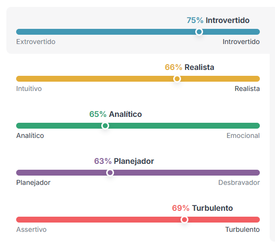

## 🧠 Perfil de Personalidade – ISTJ (O Prático)

---

## Características Gerais

- Suporte firme e confiável em diversas situações  
- Praticidade, dedicação e senso de dever inabalável  
- Valorização da tradição, estrutura e expectativas claras  
- Capacidade de transformar caos em ordem  

---

## Pontos Fortes

- Organização metódica e atenção aos detalhes  
- Cumprimento de compromissos com responsabilidade  
- Presença indispensável na vida pessoal e profissional  
- Integridade e confiabilidade como base para relações  

---

## Desafios

- Resistência a mudanças e adaptação  
- Dificuldade para expressar e compreender emoções  
- Possível falta de flexibilidade em ambientes dinâmicos  
- Pode parecer reservado ou emocionalmente distante  

---

## Carreira

- Destaca-se em ambientes estruturados e regras claras  
- Ideal para áreas como contabilidade, segurança pública, gerenciamento de projetos  
- Precisa equilibrar estabilidade com abertura à inovação  
- Orgulho em manter altos padrões de qualidade e eficiência  

---

## Crescimento Pessoal

- Expandir zona de conforto respeitando valores fundamentais  
- Desenvolver inteligência emocional e adaptabilidade  
- Abraçar novas experiências e diferentes perspectivas  
- Aprimorar qualidades naturais e trabalhar áreas limitantes  

---

## Relacionamentos

- Leal, confiável e comprometido  
- Demonstra amor por meio de ações concretas  
- Pode ter dificuldade em expressar sentimentos  
- Desafio: cultivar intimidade emocional e espontaneidade  

---

## 🧩 Perfil SCARF

O modelo SCARF avalia cinco domínios sociais que influenciam o comportamento humano, medindo a afinidade e sensibilidade a cada um deles em uma escala de 1 a 7. Pontuações mais altas indicam maior importância ou sensibilidade ao respectivo domínio.

### ⚖️ Pontuações

| Domínio     | Pontuação | Descrição                          |
|-------------|-----------|----------------------------------|
| Status      | 5.0       | Reconhecimento e respeito social |
| Certeza     | 6.3       | Preferência por previsibilidade e segurança |
| Autonomia   | 3.0       | Grau de controle sobre decisões e ações |
| Pertença    | 4.0       | Sentimento de conexão social e aceitação |
| Equidade    | 6.5       | Percepção de justiça e tratamento igualitário |

### 🔎 Interpretação

- **Certeza e Justição são prioridades:** Você valoriza ambientes previsíveis, com regras claras e justas, onde as pessoas são tratadas de forma equânime.
- **Status moderado:** Embora aprecie respeito e reconhecimento, não é o fator mais decisivo para você.
- **Autonomia relativamente baixa:** Pode preferir diretrizes claras e orientação em vez de liberdade completa para agir.
- **Relacionamento moderado:** Você mantém conexões sociais, mas não necessariamente busca forte integração ou vínculo emocional intenso.

## 🧩 Perfil DISC

O teste DISC avalia quatro estilos comportamentais principais: Dominância (D), Influência (I), Estabilidade (S) e Cautela (C). Seu perfil revela uma combinação dos estilos S/CD, com ênfase maior no Suporte.

### ⚙️ Seu Estilo

- **Suporte (S):** Você é prestativo, gentil e focado em ajudar os outros. Valoriza estabilidade e harmonia no ambiente.
- **Cauteloso (C):** É cuidadoso, metódico e gosta de fazer as coisas com precisão, observando detalhes.
- **Dominante (D):** Quando necessário, você toma a iniciativa e age com determinação para resolver problemas e alcançar resultados.

### 🔍 Características

- Combina traços orientados a pessoas e tarefas, tendendo um pouco mais para a tarefa.
- Pode ser reservado ou extrovertido dependendo do contexto.
- Prefere realizar as tarefas protegendo os sentimentos alheios.
- É capaz de agir rapidamente e com firmeza quando a situação exige.

Este perfil indica que você é uma pessoa equilibrada, que se adapta para manter relações harmoniosas, mas não hesita em assumir o controle quando necessário para garantir que as coisas sejam feitas corretamente.

### 📊 Comparativo Resumido: ISTJ × SCARF × DISC  

| **Dimensão**       | **ISTJ (O Prático)**          | **SCARF**       | **DISC (S/CD)**              |  
|--------------------|-------------------------------|-------------------------------|-------------------------------|  
| **Estilo**         | Metódico, leal, estruturado   | Alta **Certeza (6.3)** e **Equidade (6.5)** | Equilíbrio **Suporte + Cautela** (ação quando necessário) |  
| **Forças**         | Organização, confiabilidade, dever | Previsibilidade, justiça      | Harmonia, precisão, resolução prática |  
| **Desafios**       | Rigidez, reserva emocional    | Baixa Autonomia (3.0)     | Dificuldade em priorizar autonomia sobre regras |  
| **Tomada de Decisão** | Baseada em regras e tradição | Prefere diretrizes claras     | Cauteloso, mas decisivo sob pressão |  
| **Relacionamentos** | Lealdade (ações > emoções)    | Relacionamento moderado (4.0)   | Evita conflitos, protege sentimentos alheios |  
